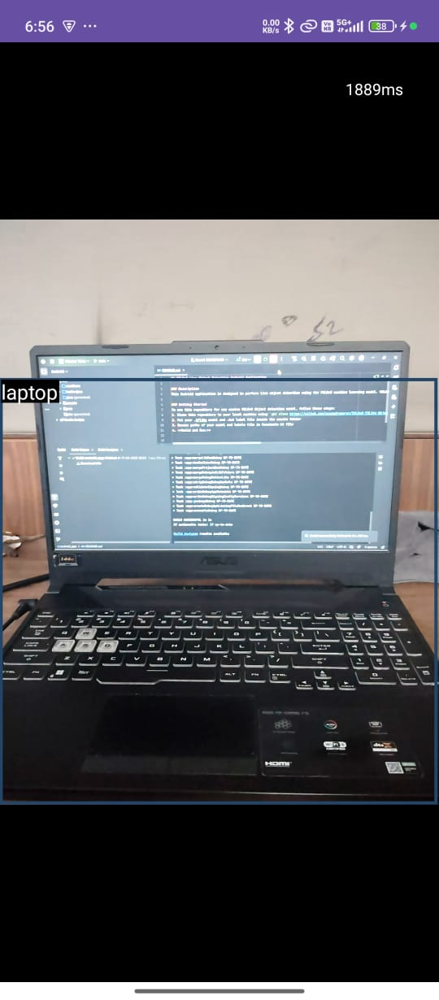
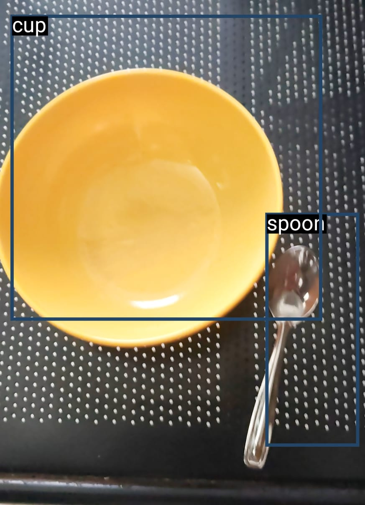

# YOLOv8 Object Detection Android Application

## Overview
This Android application performs real-time object detection using the YOLOv8s model trained on the COCO dataset. The app leverages the power of the YOLOv8 (You Only Look Once version 8) architecture to provide fast and accurate object detection directly on Android devices.

## Features
- Real-time object detection using device camera
- High-performance inference with YOLOv8s model
- Detection of 80+ object classes from the COCO dataset
- Bounding box visualization with class labels and confidence scores
- Optimized for mobile performance using TensorFlow Lite

## Project Structure
- `android_app/` - Contains the Android application code
- `model.py` - Script to download and export the YOLOv8 model to TFLite format
- `download_pretrained.py` - Script to download pretrained YOLOv8 model
- `train_export_yolov8_model.ipynb` - Jupyter notebook for training and exporting custom YOLOv8 models
- `test_images/` - Sample images for testing object detection

## COCO Dataset
The model is trained on the COCO (Common Objects in Context) dataset, which includes:
- 80+ object categories
- Over 200,000 labeled images
- Objects in their natural contexts
- Multiple objects per image with precise segmentation

The COCO dataset is widely used as a benchmark for object detection, segmentation, and captioning algorithms.

## YOLOv8s Model
YOLOv8s is the "small" variant of the YOLOv8 family, offering a good balance between:
- Detection accuracy
- Inference speed
- Model size

The model uses a single-stage detection approach, processing the entire image in one pass to predict bounding boxes and class probabilities simultaneously.

## Setup Instructions

### Prerequisites
- Android Studio 4.0+
- Android device with API level 21+ (Android 5.0 or higher)
- USB debugging enabled on your device

### Installation
1. Clone this repository:
   ```
   git clone https://github.com/bhargavak04/YOLOv8-Object-Detection-Android.git
   ```

2. Open the project in Android Studio:
   - Launch Android Studio
   - Select "Open an existing Android Studio project"
   - Navigate to the `android_app` directory and click "Open"

3. Connect your Android device and run the application:
   - Connect your device via USB
   - Click "Run" in Android Studio
   - Select your device from the list

### Custom Model Training (Optional)

If you want to train your own custom YOLOv8 model:

1. Prepare your dataset in YOLOv8 format
2. Open and modify the `train_export_yolov8_model.ipynb` notebook
3. Follow the instructions in the notebook to train and export your model
4. Replace the existing TFLite model in the Android app's assets folder

## Usage

1. Launch the app on your device
2. Grant camera permissions when prompted
3. Point your camera at objects to detect
4. The app will display bounding boxes around detected objects with class labels and confidence scores

## Demo Screenshots

Here are some screenshots of the application in action:


*The app detecting multiple objects in a real-world scene with bounding boxes and labels*


*Another example of real-time object detection with confidence scores*

## Performance Optimization

The app uses TensorFlow Lite for efficient on-device inference. Several optimizations have been applied:

- Model quantization to reduce size and improve inference speed
- GPU delegation for devices with compatible hardware
- Thread management for optimal CPU usage


## Acknowledgments

- [Ultralytics](https://github.com/ultralytics/ultralytics) for the YOLOv8 implementation
- [COCO Dataset](https://cocodataset.org/) for providing the training data
- [TensorFlow Lite](https://www.tensorflow.org/lite) for the mobile optimization framework